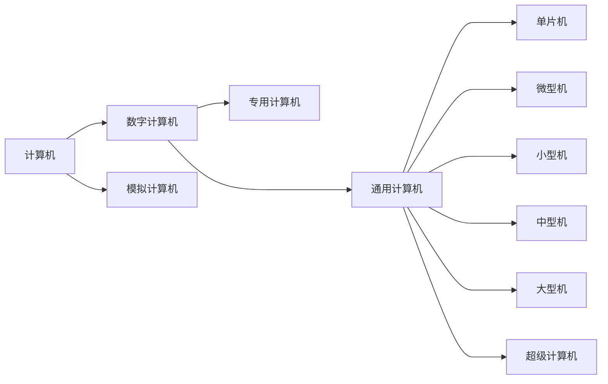
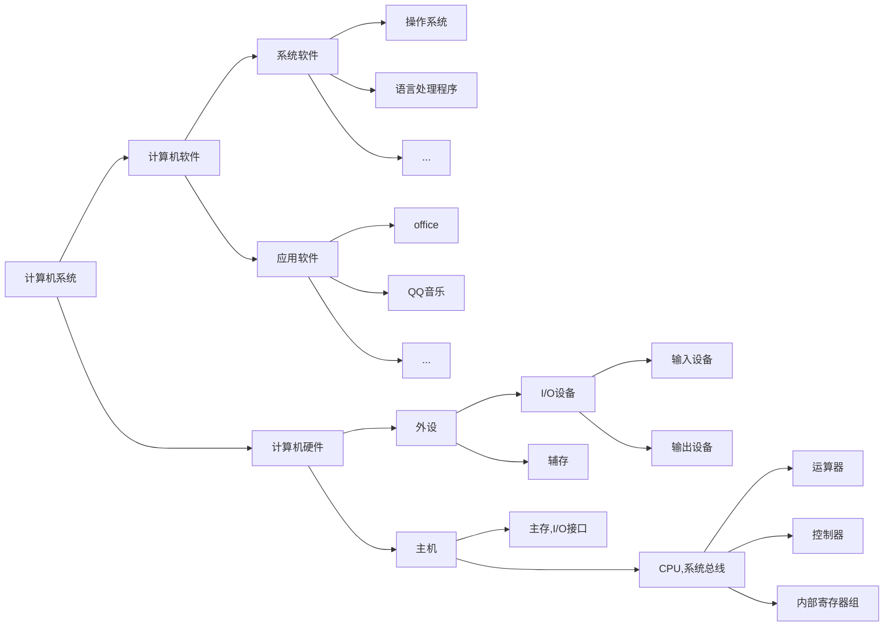

# 计算机
>高速运行的电子设备  
>对数据进行运算  
>接受输入  
>据用户要求加工信息  
>输出结果  
# 计算机发展
|发展时间|电子元件|
|---|---|
|第一代（1946-1957）|电子管|
|第二代（1958-1964）|晶体管|
|第三代（1965-1971）|中小规模集成电路|
|第四代（1971-1990）|大/超大规模集成电路|
|第五代（1991-？）|巨大规模集成电路|
>第一台计算机ENIAC特点：十进制表示，程序由插线开关实现    
>计算机发展方向：微型化，巨型化，网络化，智能化，多媒体化......  
>摩尔定律：每18个月，集成电路性能上升1倍，价格下降1半
# 计算机分类

>数字计算机：处理数字量信息，按位运算，不连续跳动运算  
>模拟计算机：处理模拟量信息，数值连续，运算过程连续  
>专用计算机：专注于某一个任务，效率和速度高，适应性差  
>通用计算机：适应性强，牺牲速度和效率
# 计算机组成

# 计算机性能指标
|计算机性能指标|解释|
|---|---|
|吞吐量（带宽）|在某一时间间隔，计算机能处理的信息量，单位b/s|
|响应时间|从输入有效到系统产生响应之间的时间度量|
|利用率|在给定的时间间隔内，系统被实际使用的时间所占的百分比|
|机器字长|运算器中一次能够完成二进制运算的位数，与总线宽度具有一定的相关性|
|总线宽度|一般指运算器和存储器之间的数据总线宽度|
|存储器容量|能存储二进制数据的位数，为所有存储元（用于保存一位0/1二进制的物理器件）的数目|
|存储器宽度|单位时间内，从主存储器中读出的二进制信息量，单位B/s|
|主频|CPU工作节拍受到主时钟控制，主频为主时钟的频率，单位Hz，1GHz=10^3MHz=10^3KHz=10^3Hz|
|时钟周期|主频倒数，单位s，1 ns=10^(-3)μs=10^(-6)s|
|CPU执行时间|CPU执行程序占CPU时间，t(cpu) = 程序时钟周期数 * CPU时钟周期|
|CPI|执行一条指令所需要的平均时钟周期数，CPI=程序时钟周期数/指令数|
|MIPS|每秒百万指令数，单位时间执行的指令数，MIPS=指令数/程序执行时间/10^6|
|FLOPS|每秒执行浮点数操作的次数，FLOPS=程序浮点数操作次数/程序执行时间|
# 冯诺伊曼结构和现代计算机结构
## 冯诺伊曼结构
  
控制器控制各个部件工作，各部件工作完了就得通知控制器，这个通知就是反馈。  
早期的结构，所有的信息都是交给运算器的，所以反馈信息也由运算器告知控制器，这也造成运算器负担过重，产生瓶颈。  

>冯诺依曼结构以运算器为核心  
>冯诺依曼提出了二进制保存数据和存储程序执行的思想  
## 现代计算机结构
  
现代计算机分散了这种负担。根据指令译码，控制器可以控制输入、输出、存取、运算。  
那么同样，指令执行结束后需要告知控制器一下，这就是反馈信号。  
反馈信号，并不一定是其他器件向控制器发出的信号，也可以是时钟周期、状态信号等。图中橘色是状态信号，反馈当前的运算状态。  

>现代计算机结构以存储器为核心，减轻了CPU数据传送的负担，提高了系统整体性能  
>将运算器，控制器，片内高速缓存统称为CPU
# 计算机硬件
## 运算器
>运算器是计算机对数据进行加工处理的中心，它主要由算术逻辑单元（ALU）、暂存寄存器、累加寄存器（ACC）、通用寄存器组、程序状态字寄存器(PSW),移位器、计数器（CT）等组成。
>运算器处理所有算术逻辑运算，通常称为算数逻辑单元(ALU).  
>采用二进制计算，一次可以计算的位数称为机器字长，机器字长决定着运算器的精度和能力。
 
|运算器组成部分|功能|
|---|---|
|算术逻辑单元|主要功能是进行算术/逻辑运算。|
|暂存寄存器|用于暂存从主存读来的数据，该数据不能存放在通用寄存器中，否则会破坏其原有内容。暂存寄存器对应用程序员是透明的。|
|累加寄存器|它是一个通用寄存器，用于暂时存放 ALU 运算的结果信息，可以作为加法运算的一个输入端。|
|通用寄存器组|如 AX、BX、CX、DX、SP 等（也常用 R0、R1...表示），用于存放操作数（包括源操作数、目的操作数及中间结果）和各种地址信息等。SP 是堆栈指针，用于指示栈顶的地址。|
|程序状态字寄存器|保留由算术逻辑运算指令或测试指令的结果而建立的各种状态信息，如溢出标志（OF）、符号标志（SF）、零标志（ZF）、进位标志（CF）等。PSW 中的这些位参与并决定微操作的形成|
|移位器|对操作数或运算结果进行移位运算。|
|计数器|控制乘除运算的操作步数。|

  

## 存储器
>存储器可以保存所有程序和数据. 分为内存（CPU可直接访问）和外存（CPU不可直接访问）   
>采用二进制形式保存程序和数据，按照存储单元组织的，读写存储单元之前必须给出单元地址.  

|存储器相关概念|功能或组成|
|---|---|
|内存|存放系统当前运行所需的程序和数据的半导体存储器，称为内存储器，简称内存。|
|外存|用于存放程序和数据，但不能被CPU直接访问的大容量存储器。|
|存储元|用于保存一位0/1二进制数据的物理器件.  |
|存储单元|能够保存一个字节数据的器件，由若干个存储元构成.  |
|单元地址|能区分每一个存储单元的编号，一般从0开始编号. | 
|存储容量|一个存储器所能保存的二进制信息的总量,所有存储元的总数目.  |

地址译码器是主存等存储器的组成部分，其作用是根据输入的地址码唯一选定一个存储单元，它不是 CPU 的组成部分。
  
    
## 控制器    

>控制器：据所要执行的指令的功能，按顺序发送各种控制命令，协调计算机各个部件的工作。
>控制器有硬布线控制器和微程序控制器两种类型。控制器由程序计数器(PC),指令寄存器(IR),指令译码器,存储器地址寄存器(MAR),存储器数据寄存器(MDR),时序系统和微操作信号发生器等组成。    
>任务：  
>>解释和执行指令  
>>控制指令的执行顺序  
>>负责指令执行过程中操作数的寻址  
>>据指令执行，协调相关部件的工作
>>
>过程：取指->译码->执行，循环进行，直至程序结束  
>指令形式：由操作码和地址码组成

|控制器组成部分|功能|
|---|---|
|MAR|存储器地址寄存器，存放要访问的主存单元的地址|
|MDR|存储器数据寄存器，用于存放向主存写入的信息或从主存中读出的信息。|
|程序计数器|用于指出下一条指令在主存中的存放地址。CPU 根据 PC 的内容去主存中取指令。PC 具有自增功能。|
|指令寄存器|用于保存当前正在执行的那条指令|
|指令计数器|指令按顺序执行的控制部件|
|指令译码器|仅对操作码字段进行译码，向控制器提供特定的操作信号。|
|时序系统|用于产生各种时序信号，它们都由统一时钟（CLOCK）分频得到。|
|微操作信号发生器|根据 IR 的内容（指令）、PSW 的内容（状态信息）及时序信号，产生控制整个计算机系统所需的各种控制信号，其结构有组合逻辑型和存储逻辑型两种。|

|控制器相关概念|功能或组成|
|---|---|
|操作码|指出指令所要进行的操作  |
|地址码|指出进行操作的数据存放位置| 
|取指周期|取指令的一段时间|
|执行周期|执行指令的一段时间|
|数据字|要处理的数据|
|指令字|要执行的指令|
|指令流|取指周期中从内存读出的信息流|
|数据流|执行周期中从内存中读出的信息|

>数据总线的位数与处理器的位数相同，它表示 CPU 一次能处理的数据的位数，即 CPU 的位数。  
>程序计数器的位数取决于存储器的容量。  
>指令寄存器的位数取决于指令字长。  
>通用寄存器的位数取决于机器字长。  

**计算机如何能识别指令和数据：在于指令的执行阶段来决定或者说控制器的工作周期来决定，在取指阶段读出的是指令，在执行阶段读出的是指令执行所需要的操作数。**  
  
输入设备：将人们熟悉的信息形式转化为机器内部能够接受和识别的二进制形式的设备。  
输出设备：将计算机的处理结果转化为人或其他设备能够接受和识别的信息形式的设备。  
适配器：主机和不同速度外设之间的一种连接部件，用于主机和外设之间的信息转换。  
系统总线：构成计算系统的骨架，是多个系统部件之间进行数据传送的公共通路。  
  
 # 计算机系统的层次和结构
  
  

>硬件：计算机中所使用的电子线路和物理装置。  
>软件：指挥硬件系统工作的程序集合，由人们事先编制成具有各类特殊功能的信息组成。  
>固件：具有某软件功能的硬件，一般用ROM类存储器实现，如主板上的BIOS等，功能是软件，形态是硬件。  
>其中M1->M0是由微程序将机器指令转换为微指令，硬件才可执行
