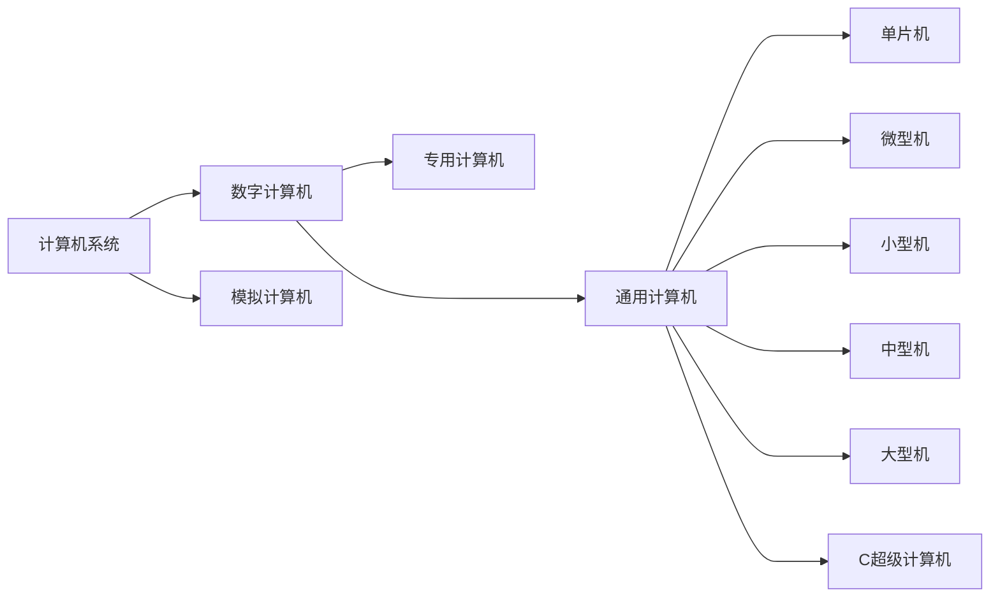
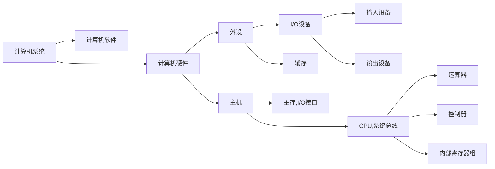

# 计算机
>高速运行的电子设备  
>对数据进行运算  
>接受输入  
>据用户要求加工信息  
>输出结果  
# 计算机发展
|发展时间|电子元件|
|---|---|
|第一代（1946-1957）|电子管|
|第二代（1958-1964）|晶体管|
|第三代（1965-1971）|中小规模集成电路|
|第四代（1971-1990）|大/超大规模集成电路|
|第五代（1991-？）|巨大规模集成电路|
>第一台计算机ENIAC特点：十进制表示，程序由插线开关实现    
>计算机发展方向：微型化，巨型化，网络化，智能化，多媒体化......  
>摩尔定律：每18个月，集成电路性能上升1倍，价格下降1半
# 计算机分类

>数字计算机：处理数字量信息，按位运算，不连续跳动运算  
>模拟计算机：处理模拟量信息，数值连续，运算过程连续  
>专用计算机：专注于某一个任务，效率和速度高，适应性差  
>通用计算机：适应性强，牺牲速度和效率
# 计算机组成

# 计算机性能指标
|计算机性能指标|解释|
|---|---|
|吞吐量（带宽）|在某一时间间隔，计算机能处理的信息量，单位b/s|
|响应时间|从输入有效到系统产生响应之间的时间度量|
|利用率|在给定的时间间隔内，系统被实际使用的时间所占的百分比|
|机器字长|运算器中一次能够完成二进制运算的位数|
|总线宽度|一般指运算器和存储器之间的数据总线宽度，与总线宽度具有一定的相关性|
|存储器容量|能存储二进制数据的位数，为所有存储元（用于保存一位0/1二进制的物理器件）的数目|
|存储器宽度|单位时间内，从主存储器中读出的二进制信息量，单位B/s|
|主频|CPU工作节拍受到主时钟控制，主频为主时钟的频率，单位Hz，1GHz=10^3MHz=10^3KHz=10^3Hz|
|时钟周期|主频倒数，单位s，1 ns=10^(-3)μs=10^(-6)s|
|CPU执行时间|CPU执行程序占CPU时间，t(cpu) = 程序时钟周期数 * CPU时钟周期|
|CPI|执行一条指令所需要的平均时钟周期数，CPI=程序时钟周期数/指令数|
|MIPS|每秒百万指令数，单位时间执行的指令数，MIPS=指令数/程序执行时间/10^6|
|FLOPS|每秒执行浮点数操作的次数，FLOPS=程序浮点数操作次数/程序执行时间|
# 冯诺伊曼结构和现代计算机结构
## 冯诺伊曼结构
  
>冯诺依曼结构以运算器为核心  
>冯诺依曼提出了二进制和存储程序的思想
## 现代计算机结构

>现代计算机结构以存储器为核心，减轻了CPU数据传送的负担，提高了系统整体性能
>将运算器，控制器，片内高速缓存统称为CPU
